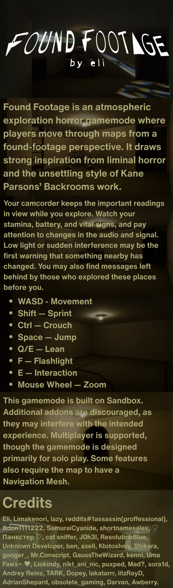

# Found Footage



A Garry's Mod found-footage gamemode with VHS presentation, custom flashlight/audio systems, horror encounters, and persistent cross-server map messages.

## Repository layout

- `gamemode/` — Garry's Mod Lua code
- `content/` — bundled models, materials, sounds, fonts, and shaders
- `services/message-service/` — Cloudflare Worker and D1 message backend
- `tools/message-monitor/` — native GTK administrator monitor
- `tools/` — Workshop, cleanup, and audio utilities

## Global map messages

Players can place cassette messages that persist globally by exact map name. Normal creation is mediated by the trusted GMod server and uses the connected player's server-side SteamID64. Public feeds omit author identity.

The live service is configured through `FF_CONFIG.MapMessages.APIBaseURL` in `gamemode/configuration.lua`.

### Backend

```bash
cd services/message-service
npm ci
npm run check
npm test
./deploy-cloudflare.sh
```

Credentials are stored only in ignored local files and Cloudflare secrets. Never commit `.admin-token`, `.env`, `.dev.vars`, the server-ingest token, `.wrangler`, or `node_modules`.

### Administrator monitor

```bash
cd tools/message-monitor
./run.sh
```

The monitor reads `services/message-service/.admin-token` by default. `FOUNDFOOTAGE_MESSAGE_API` and `FOUNDFOOTAGE_ADMIN_TOKEN_FILE` can override the defaults.
